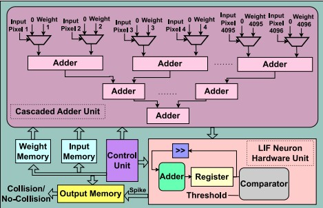

# SNN_LIF

This repository provides the **SystemVerilog** source code for a hardware-accelerated Spiking Neural Network (SNN). The design follows a modular architecture optimized for FPGA deployment.

# Reference
This project is based on the paper:
**"Energy-Aware FPGA Implementation of Spiking Neural Network with LIF Neurons"** (https://arxiv.org/abs/2411.01628)

## System Architecture
The design is structured into the following core modules:

* **`TTNT_1`**: The wrapper that integrates the Control Unit, Datapath, and Memory blocks. It handles external I/O signals (clk, rst, input data).
* **`LIF`**: Implements the **Leaky Integrate-and-Fire** logic. It calculates the membrane potential $V_{mem}$ updates, leakage, and threshold comparison to generate output spikes.
* **`cas_adder`**: A tree-adder structure replacing standard multipliers. It efficiently sums binary inputs and weights to reduce resource utilization.
* **`Control`**: A Finite State Machine (FSM) that manages the timing signals, memory read/write addresses.
* **`In_memory` / `We_memory` / `Out_memory` **: Stores input spikes, synaptic weights (Q1.15 fixed-point), and output results.

## Data Flow
1.  **Input Processing:** Input spikes and weights are fetched from memory and processed by the `cas_adder` to compute the weighted sum.
2.  **Neuron Update:** The `LIF` module receives the sum, updates the membrane potential (Integrated & Leak), and checks against the threshold ($V_{thr}$).
3.  **Output Generation:** If $V_{mem} \ge V_{thr}$, a spike (1-bit) is generated, and the potential is reset. The result is stored in the output memory.

## Simulation & Synthesis
* **Testbench:** Located in file `tb_TTNT`, generating clock, reset, and stimulus vectors to verify the spiking behavior.
* **Tools:**
    * **Simulation:** Questasim.
    * **Synthesis:** Intel Quartus Prime.
